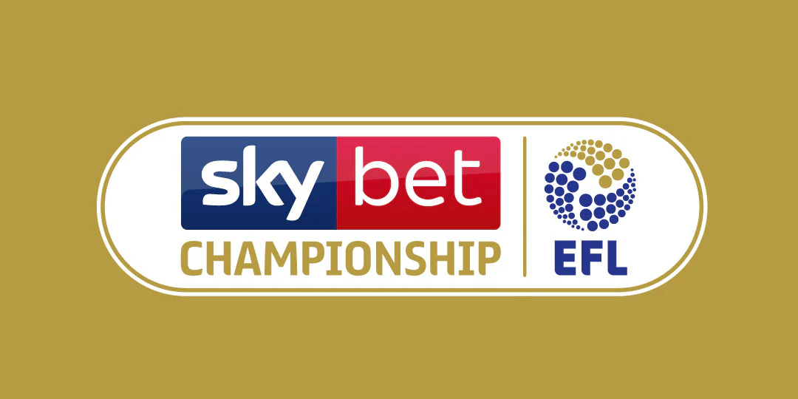

# EFL Championship Win Predictor 

This project predicts whether or not a team will win for all matches in the second half of the EFL Championship 2025/26. These predictions are based based on historical Championship match data.

---

## Features

- **Data Collection & Cleaning:** Loads and processes historical match data from [matches.csv](matches.csv), including feature engineering and encoding categorical variables.
- **Exploratory Data Analysis:** Visualizes trends and distributions in match outcomes, team performance, and key statistics.
- **Feature Engineering:** Implements rolling averages, categorical encoding, and time-based features to enhance predictive power.
- **Machine Learning Modeling:** Trains and evaluates a Random Forest classifier using scikit-learn to predict match wins.
- **Model Evaluation:** Calculates accuracy and precision, and provides detailed output for model predictions versus actual results.
- **Interactive Analysis:** All steps are documented and reproducible in [match_predictions.ipynb](match_predictions.ipynb), making it easy to follow and adapt.
- **Visualization:** Uses pandas and Jupyter rich outputs for clear, interactive data presentation.

---

## How to Use

1. **Clone the Repository**
   ```
   git clone https://github.com/jamesbcn/football-win-predictor.git
   cd football-win-predictor
   ```

2. **Create and Activate a Virtual Environment (Optional)**
    ```
    python -m venv venv
    source venv/bin/activate      # On macOS/Linux
    venv\Scripts\activate         # On Windows
    ```

3. **Install Dependencies**
   ```
   pip install -r requirements.txt
   ```

4. **Open the Jupyter Notebook File**
    Launch Jupyter Lab or VS Code and open the `match_predictions.ipynb` file, then run the cells.

---

## Skills Demonstrated

- **Data Science Workflow:** End-to-end pipeline from raw data to actionable predictions.
- **Python & Pandas:** Advanced data manipulation, cleaning, and feature engineering.
- **Machine Learning:** Model selection, training, and evaluation using scikit-learn.
- **Jupyter Notebooks:** Clear, well-documented, and interactive analysis.
- **Visualization:** Effective use of tables and plots for data exploration and results presentation.
- **Reproducibility:** All steps and results can be reproduced by running the notebook.

---

## File Overview

- [matches.csv](matches.csv): Historical match data for the EFL Championship.
- [match_predictions.ipynb](match_predictions.ipynb): Main notebook with all data processing, modeling, and analysis.
- [banner.png](banner.png): Project logo for the README file.
- [README.md](README.md): Project documentation and usage instructions.
